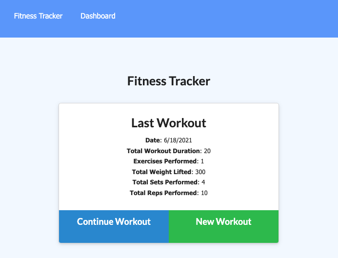
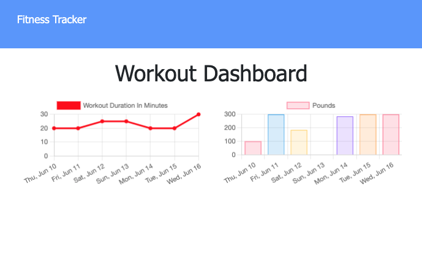

# NoSQL_FitnessTracker

## Description


Unit 17 NoSQL Homework: Workout Tracker:

This is a Workout Tracker App created with a `MongoDB ` database and `Mongoose schema`, which handles routes with `Express`. The user can log multiple exercises in a workout on a given day as well as track the name, type, weight, sets, reps, and duration of exercise. 

App deployed on Heroku: [fitnezz-trakker](/)

Repository on GitHub: [NoSQL_FitnessTracker](/)


## Table of Content
* [User Story](user-story)
* [Business Context](business-context)
* [Mock Up](mock-up)
* [Installation](installation)
* [Usage](usage)
* [Features](features)
* [Resources](resources)
* [Submitted For Review](submitted-for-review)
* [Questions](questions)
* [License](license)

## User Story

```
As a user, I want to be able to view create and track daily workouts. I want to be able to log multiple exercises in a workout on a given day. I should also be able to track the name, type, weight, sets, reps, and duration of exercise. If the exercise is a cardio exercise, I should be able to track my distance traveled.
 ```
## Business Context

A consumer will reach their fitness goals more quickly when they track their workout progress.

## Mock-Up

The following screenshots demonstrate the apps functionality:




<br>





## Installation 

`Node.Js` must be installed to run this application.

You'll need to set up a `MongoDB Atlas` account and connect a database to your application.

Fork or clone repository and open application.

From the command line: 

run `npm init -y` to create `package.json`

`npm i` for package manager and `node_modules`

`npm i mongoose` to create path to Mongo database. 

`npm i express` for web framework for node.js

`npm i morgan`  for request logger middleware.


## Usage

Open terminal from `server.js` file in local directory. 

First, run `node seeders/seed` to populate the database with initial data set. 

Then, Run `node server` from the command-line to start the server.

Establish connection to localhost: 3000 in `Mongo Atlas`.

Navigate to `http://localhost:3000/` in browser window.

Yo can start using the Fitness Tracker as soon as the page loads.

The `Features` of this App are described in the next section.

Save time and skip installation! For greater accessibility and ease of use, check out the deployed application on Heroku: 

Visit this link: [Fitness Tracker](/)


## Features

When the page loads, users are given the option to create a new workout or continue with their last workout.

This app includes the following features:

* Add exercises to the most recent workout plan.
* Add new exercises to a new workout plan.
* View the combined weight of multiple exercises from the past seven workouts on the `stats` page.
* View the total duration of each workout from the past seven  workouts on the `stats` page.

## Resources

[Heroku](https://www.heroku.com/) cloud-application platform

[MongoDB](https://www.mongodb.com/cloud/atlas/) NoSQL document database composed of field and value pairs.

[NodeJS](https://nodejs.org/en/) open-source, cross-platform, back-end JavaScript runtime environment.

[Mongoose](https://www.npmjs.com/package/mongoose)a MongoDB object modeling tool designed to work in an asynchronous environment. Mongoose supports both promises and callbacks.

[Express](https://www.npmjs.com/package/express) a node.js web application framework known as middleware for API creation.

[Morgan](https://www.npmjs.com/package/morgan) HTTP request logger middleware for node.js

[MongoDB documentation on the $addFields](https://docs.mongodb.com/manual/reference/operator/aggregation/addFields/) aggregate function to dynamically add up and return the total duration for each workout. 
[MongoDB documentation on the $sum operator](https://docs.mongodb.com/manual/reference/operator/aggregation/sum/)

[Mongoose documentation on aggregate functions](https://mongoosejs.com/docs/api.html#aggregate_Aggregate) to learn how it can be accomplished.

 [Deploy with Heroku and MongoDB Atlas](./assets/MongoAtlas-Deploy.md)

[Set Up MongoDB Atlas](./assets/MongoAtlas-Setup.md)

## Submitted For Review

* The URL to the deployed application

* The URL to the GitHub repository


## Questions

[GitHub Profile](https://github.com/rdevans87)


## License

[MIT LICENSE](LICENSE)